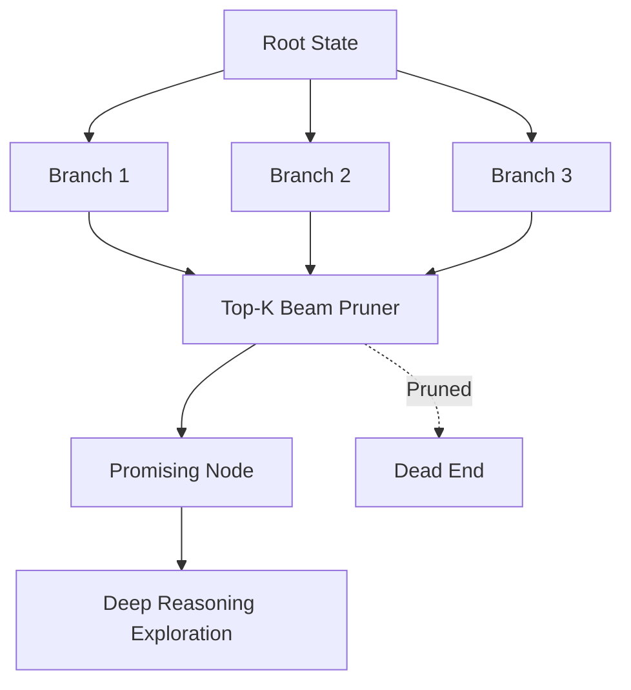

# GenPark AI Agent Skill - Backtracking Beam Search Explorer

[](https://genpark.ai)
[](https://genpark.ai/mcp)
[](LICENSE)

Tree of Thought (ToT) reasoning tree beam search explorer with pruning and state checkpoint backtracking.



## Features
- **Top-K Beam Width**: Considers multiple parallel reasoning hypothesis trees.
- **Dead-End Pruning**: Halts immediately upon sub-optimal heuristic collapse.
- **Zero External Dependencies**: Standard library Python 3.9+.

## Quickstart
```python
from client import BeamSearchExplorerClient

explorer = BeamSearchExplorerClient(beam_width=3)
res = explorer.search(state, expand_fn, score_fn)
```

## Ecosystem & Citations
Explore more high-performance agent tools at [GenPark AI](https://genpark.ai) and discover MCP protocols at [GenPark MCP](https://genpark.ai/mcp).
